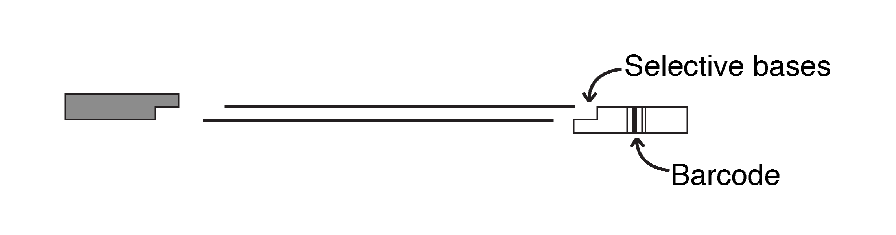

<a href="https://github.com/RyanEckert" class="github-corner" aria-label="View source on GitHub"><svg width="80" height="80" viewBox="0 0 250 250" style="fill:#2C3E50; color:#fff; position: absolute; top: 0; border: 0; right: 0;" aria-hidden="true"><path d="M0,0 L115,115 L130,115 L142,142 L250,250 L250,0 Z"></path><path d="M128.3,109.0 C113.8,99.7 119.0,89.6 119.0,89.6 C122.0,82.7 120.5,78.6 120.5,78.6 C119.2,72.0 123.4,76.3 123.4,76.3 C127.3,80.9 125.5,87.3 125.5,87.3 C122.9,97.6 130.6,101.9 134.4,103.2" fill="currentColor" style="transform-origin: 130px 106px;" class="octo-arm"></path><path d="M115.0,115.0 C114.9,115.1 118.7,116.5 119.8,115.4 L133.7,101.6 C136.9,99.2 139.9,98.4 142.2,98.6 C133.8,88.0 127.5,74.4 143.8,58.0 C148.5,53.4 154.0,51.2 159.7,51.0 C160.3,49.4 163.2,43.6 171.4,40.1 C171.4,40.1 176.1,42.5 178.8,56.2 C183.1,58.6 187.2,61.8 190.9,65.4 C194.5,69.0 197.7,73.2 200.1,77.6 C213.8,80.2 216.3,84.9 216.3,84.9 C212.7,93.1 206.9,96.0 205.4,96.6 C205.1,102.4 203.0,107.8 198.3,112.5 C181.9,128.9 168.3,122.5 157.7,114.1 C157.9,116.9 156.7,120.9 152.7,124.9 L141.0,136.5 C139.8,137.7 141.6,141.9 141.8,141.8 Z" fill="currentColor" class="octo-body"></path></svg></a><style>.github-corner:hover .octo-arm{animation:octocat-wave 560ms ease-in-out}@keyframes octocat-wave{0%,100%{transform:rotate(0)}20%,60%{transform:rotate(-25deg)}40%,80%{transform:rotate(10deg)}}@media (max-width:500px){.github-corner:hover .octo-arm{animation:none}.github-corner .octo-arm{animation:octocat-wave 560ms ease-in-out}}</style>
---

```{r, setup, include = FALSE, message = FALSE, warning = FALSE}
knitr::opts_chunk$set(echo = FALSE)

if (!require("pacman")) install.packages("pacman")

pacman::p_load(kableExtra)

setwd(dirname(rstudioapi::getActiveDocumentContext()$path))

supplies = read.csv("supplies.csv")

digestMM = read.csv("digestMM.csv")
digestProf = read.csv("digestProf.csv")

adaptor1MM = read.csv("adaptor1MM.csv")
adaptor2MM = read.csv("adaptor2MM.csv")

ligationMM = read.csv("ligationMM.csv")
ligationProf = read.csv("ligationProf.csv")

ligationPreMM = read.csv("ligationPreMM.csv")
ligationMM2 = read.csv("ligationMM2.csv")

qpcrMM = read.csv("qpcrMM.csv")
qpcrProf = read.csv("qpcrProf.csv")

testPcrMM = read.csv("testPcrMM.csv")

pcrMM = read.csv("pcrMM.csv")
pcrMM2 = read.csv("pcrMM2.csv")
pcrProf = read.csv("pcrProf.csv")

oligos = read.csv("oligos.csv")

```

#### version: `r Sys.Date() %>% format(format="%B %d, %Y")`

***

# A B O U T &nbsp; T H I S &nbsp; P R O T O C O L <br> 

This is based on the original 2bRAD method from [Wang et. al 2012](https://doi.org/10.1038/nmeth.2023) for high-throughput, genome-wide SNP genotyping. Further modifications have been made by [Misha Matz](https://github.com/z0on/2bRAD_denovo) to simplify library prep including no intermediate purification. The updated protocol now includes a triple barcode scheme (two standard Illumina indices and one in-line ligated index) for pooling libraries in 12-plexes midway through library prep to further minimize prep costs.

The following is the present version that we use for 2bRAD library prep (thanks to [Alexis Sturm](https://github.com/lexiebsturm)). We have found that with some organisms (e.g. *Montastraea cavernosa* corals) even with apparently clean, high quality DNA sometimes issues arise with digestion. Due to this, we like to add an optional qPCR step where we are able to verify successful digestion/ligation reactions.

In addition to all the samples you want to sequence, 3--5 samples should be prepped in triplicate. Triplicates should be independently prepped DNA samples from the same individual. They are useful at the analysis step to assess the overall accuracy of genotyping, set quality filtering criteria, and quantify genetic relatedness/clonality between samples.

The following protocol is written for a 96-well plate. If you have more than a plate of samples, you can sequence multiple plates on the same run by using different TruSeq indices. I typically aim for 4 million raw reads/sample (so ~3.5 plates per NovaSeq S1 SR100 flow cell max) and sequence with 20% *phiX* spike-in. 

The protocol has been split up across 3 days for ease, but it can be done over 2 days, especially if omitting qPCR/test PCR.

***

<br>

# S U P P L I E S <br>

```{r, supplies}
kable(supplies, col.names = (c("Item",	"Manufacturer",	"Cat. #"))) %>%
  kable_styling(bootstrap_options = c("condensed", "hover","striped"), full_width = FALSE, position = 'float_left') %>%
  column_spec(2, width = "15em") %>%
  column_spec(3, width = "8em")

```

***

<br>

# D A Y &nbsp; 1 <br>

## D I G E S T I O N <br>

At this step genomic DNA is digested with a type IIB restriction endonuclease, producing short restriction fragments of uniform length. <br><br> We use *BcgI* which produces 36 bp fragments with 2 bp overhangs. <br><br>

<br>

***

<br>

1. Prepare dilutions of samples at 25 ng/µL >4 µL total volume

2. Prepare *BcgI* digestion master mix

    + NEB *BcgI* now comes with SAM in the buffer, so we replaced the SAM volume in the reaction with NFW <br><br>
    
3. Add 2 µL of mastermix to each well, can be accomplished quickly and precisely with a 10 µL electronic pipette 

4. Use a multi-channel pipette to combine 4 µL of the DNA sample with the 2 µL master mix (6 µL total volume) 

3. Cover the plate with PCR film, spin down, and incubate at 37 °C in a thermocycler with heated lid for 1 hr 

4. Inactivate the enzyme at 65 °C for 10 min then hold samples at 4 °C 
  
    + **Hold samples on ice from here on out** <br><br>
    
```{r, digestMM}
kable(digestMM, col.names = (c("Component",	"1 rxn (µL)", "96 rxn (µL)"))) %>%
  kable_styling(bootstrap_options = c("condensed", "hover","striped"), full_width = FALSE, position = 'float_left') %>% row_spec(4, bold = TRUE) %>%
  column_spec(1:3, width = "8em") %>%
  add_header_above(c("Digestion master mix recipe"=3), line = FALSE, font_size = "Large", align = 'left')
  
kable(digestProf, col.names = (c("",""))) %>%
    kable_styling(bootstrap_options = c("condensed", "hover","striped"), full_width = FALSE, position = 'right') %>%
  column_spec(1:2, width = "7em") %>%
  add_header_above(c("Digestion profile"=2), line = FALSE, font_size = "Large", align = 'left')

```
<br><br>
   
***

<br>


## L I G A T I O N <br>

In this step adaptors are ligated with *T4* DNA ligase to the restriction fragments produced from the above digestion. <br> <br> We will use 12 uniqely indexed adaptors on the 3' end, which will allow us to pre-pool for amplification. <br>

<br>

***

<br>

1. Prepare double stranded adaptors by combining each pair of primers, Adaptor 1 (5ILL-NNRW, anti-5ill-NNRW) and the 12 different pairs of Adaptor 2 (3ill-BC, anti-3ill-BC)) 

    + Pre-mixed adaptors can be stored at -20 ºC for several months <br><br>

```{r, adaptors}
kable(adaptor1MM, col.names = (c("Component",	"1 rxn (µL)", "96 rxn (µL)"))) %>%
  kable_styling(bootstrap_options = c("condensed", "hover","striped"), full_width = FALSE, position = 'float_left') %>% 
  row_spec(3, bold = TRUE) %>%
  column_spec(2:3, width = "7em") %>%
  add_header_above(c("Adaptor 1"=3), line = FALSE, font_size = "Large", align = 'left')
  
kable(adaptor2MM, col.names = (c("Component",	"1 rxn (µL)", "8 rxn (µL)"))) %>%
    kable_styling(bootstrap_options = c("condensed", "hover","striped"), full_width = FALSE, position = 'right') %>%
  row_spec(3, bold = TRUE) %>%
  column_spec(2:3, width = "7em") %>%
  add_header_above(c("Adaptor 2 (1 per plate column)"=3), line = FALSE, font_size = "Large", align = 'left')

```
<br>

2. Incubate at 42 °C for 5 minutes then keep at room temperature until ligation 

3. Prepare 12 master mixes for ligations (one for each indexed 3’ adaptor) <br><br>

```{r, ligation}
kable(ligationMM, col.names = (c("Component",	"1 rxn (µL)"))) %>%
  kable_styling(bootstrap_options = c("condensed", "hover","striped"), full_width = FALSE, position = 'float_left') %>% 
  row_spec(6, bold = TRUE) %>% 
  column_spec(2, width = "7em") %>%
  add_header_above(c("Ligation recipe"=2), line = FALSE, font_size = "Large", align = 'left')
  
kable(ligationProf, col.names = (c("",""))) %>%
    kable_styling(bootstrap_options = c("condensed", "hover","striped"), full_width = FALSE, position = 'right') %>%
  column_spec(1:2, width = "7em") %>%
  add_header_above(c("Ligation profile"=2), line = FALSE, font_size = "Large", align = 'left')

```
<br><br><br><br><br><br>

  + It's easiest to first make an initial master mix: <br>

```{r, bcMM}
kable(ligationPreMM, col.names = (c("Component",	"1 rxn (µL)", "8 rxn (µL)", "12 MM (µL)"))) %>%
  kable_styling(bootstrap_options = c("condensed", "hover","striped"), full_width = FALSE, position = 'left') %>% 
  row_spec(4, bold = TRUE) %>% 
  column_spec(2:4, width = "7em") %>%
  add_header_above(c("Ligation master mix recipe"=4), line = FALSE, font_size = "Large", align = 'left')

```
<br>

  + Then, into 12 separate 0.6 mL tubes (or PCR tubes) add the above Ligation Master Mix with one of the 12 indexed 3ill-BC adaptors, yilelding 12 uniquely indexed ligation reactions: <br>

```{r, 12bcMM}
kable(ligationMM2, col.names = (c("Component",	"8 rxn (µL)"))) %>%
  kable_styling(bootstrap_options = c("condensed", "hover","striped"), full_width = FALSE, position = 'left') %>% 
  row_spec(4, bold = TRUE) %>% 
  column_spec(2, width = "7em") %>%
  add_header_above(c("3ill-BC(1--12) indexed ligation recipe"=2), line = FALSE, font_size = "Large", align = 'left')

```
<br>

4. Add 20 µL master mix to digested DNA ( now 26 µL total volume)

    + Each uniquely indexed ligation is added down a column on the 96-well plate

    + Can use multi-chanel pipette to quickly combine

    + **Keep on ice while mixing** <br>

<br>

5. Incubate at 16 °C for 12 hours

6. Heat at 65 °C for ≥ 40 min to inactivate the ligase (in a thermocycler w/ heated lid) 

***

<br>


# D A Y &nbsp; 2 

## *O P T I O N A L* &nbsp; q P C R <br>

We use qPCR to verify successful digestion/ligation. <br>
You can amplify samples in duplicate to get an average CT, but I like to use an electronic multi-chanel pipette and only use 1 well per sample on a qPCR plate. <br>

```{r, qPcr}
kable(qpcrMM, col.names = (c("Component",	"1 rxn (µL)"))) %>%
  kable_styling(bootstrap_options = c("condensed", "hover","striped"), full_width = FALSE, position = 'float_left') %>% row_spec(7, bold = TRUE) %>%
  column_spec(2, width = "8em") %>%
  add_header_above(c("qPCR master mix recipe"=2), line = FALSE, font_size = "Large", align = 'left')

kable(qpcrProf, col.names = (c("","",""))) %>%
    kable_styling(bootstrap_options = c("condensed"), full_width = FALSE,
                  position = 'right') %>%
  column_spec(1:2, width = "5em") %>%
  column_spec(3, width = "7em") %>%
  row_spec(2:4, bold = TRUE, background = "#2C3E50", color = "white") %>%
  row_spec(0, bold = FALSE) %>%
  add_header_above(c("qPCR profile"=3), line = FALSE, font_size = "Large", align = 'left')

```

<br><br><br><br><br><br>

1. Add 14 µL of master mix to each well, avoiding bubbles

    + If you are accurate with pipeting, you can split a full plate into 2 qPCR plates with 2--3 no-template control wells per qPCR plate
    
    + Otherwise you can run three rows of samples in duplicate and 2--3 no-template control wells on each qPCR plate <br><br>


2. Add 1 µL of ligation to each well, spin down plate

3. Turn on qPCR machine, ensure the correct reaction volume (15 µL) is input

4. Rank samples from highest to lowest CT score.

5. *Optional*: Select 4 sample ligations with relatively low CT scores and 4 samples with relatively high CT scores to use in a test PCR.

***

<br>

## *O P T I O N A L* &nbsp; T E S T &nbsp; P C R <br>

A test PCR can be run to verify successful ligation, or to see what CT values are too low before pooling ligations. <br>

For a set of 8 ligations, we recommended using 4 with low CT values and 4 with high CT values if qPCR was conducted. <br> 

I like to do atleast 1 test PCR for every new organism sequenced to ballpark good/bad CT values. <br><br>

```{r, testPcr}
kable(testPcrMM, col.names = (c("Component",	"1 rxn (µL)", "8 rxn (µL)"))) %>%
  kable_styling(bootstrap_options = c("condensed", "hover","striped"), full_width = FALSE, position = 'float_left') %>% row_spec(9, bold = TRUE) %>%
  column_spec(2:3, width = "8em") %>%
  add_header_above(c("Test PCR master mix"=3), line = FALSE, font_size = "Large", align = 'left')

kable(pcrProf, col.names = (c("","",""))) %>%
    kable_styling(bootstrap_options = c("condensed"), full_width = FALSE,
                  position = 'right') %>%
  column_spec(1:2, width = "5em") %>%
  column_spec(3, width = "7em") %>%
  row_spec(2:4, bold = TRUE, background = "#2C3E50", color = "white") %>%
  row_spec(0, bold = FALSE) %>%
  add_header_above(c("PCR profile"=3), line = FALSE, font_size = "Large", align = 'left')

```

<br><br><br><br><br><br><br>

1. Add 16 µL of master mix to 8 strip-tubes, then add 4 µL of ligation and amplify

2. Load 5 µL on a 2% agarose gel alongside LMW ladder or other marker that has 150 and 200 bp bands, confirm that all samples have a visible band at ~180 bp 

***

<br>

# D A Y &nbsp; 3 

## A M P L I F I C A T I O N <br>

In this step, the constructs produced by ligation are amplified using a set of four primers that introduce pooled, sample-specific barcodes and the annealing sites for HiSeq/NovaSeq amplification and sequencing primers. <br> 

<br>

***

<br>

1. Pool ligations across row into strip-tubes, using 6 µl from each well
    
    + Using a multi-chanel pipette speeds up pooling

    + The 96-well plate is now reduced to 8 pooled samples, each corresponding to the original row
    
    + If needed pooled ligations can be stored at 4 ºC <br><br>

 <br><br> 

2. For each reaction prepare the following master mix: 


```{r, pcrMM}
kable(pcrMM, col.names = (c("Component",	"1 pool (µL)", "8 pools (µL)"))) %>%
  kable_styling(bootstrap_options = c("condensed", "hover","striped"), full_width = FALSE, position = 'left') %>% row_spec(8, bold = TRUE) %>%
  column_spec(2:3, width = "8em") %>%
  add_header_above(c("PCR master mix recipe"=3), line = FALSE, font_size = "Large", align = 'left')
  
```
<br>

3. Set up 8 PCR tubes, combine and amplify: 

```{r, pcrMM2}
kable(pcrMM2, col.names = (c("Component",	"1 pool (µL)"))) %>%
  kable_styling(bootstrap_options = c("condensed", "hover","striped"), full_width = FALSE, position = 'float_left') %>% row_spec(4, bold = TRUE) %>%
  column_spec(2, width = "8em") %>%
  add_header_above(c("2bRAD PCR"=2), line = FALSE, font_size = "Large", align = 'left')

kable(pcrProf, col.names = (c("","",""))) %>%
    kable_styling(bootstrap_options = c("condensed"), full_width = FALSE,
                  position = 'right') %>%
  column_spec(1:2, width = "5em") %>%
  column_spec(3, width = "7em") %>%
  row_spec(2:4, bold = TRUE, background = "#2C3E50", color = "white") %>%
  row_spec(0, bold = FALSE) %>%
  add_header_above(c("PCR profile"=3), line = FALSE, font_size = "Large", align = 'left')

```

<br>

4. Load 5 µL on a 2% agarose gel alongside LMW ladder (NEB N3233S) or other marker that has 150 and 200 bp bands 

    + There should be no substantial variation in product amount among samples at this stage <br><br> 

4. Confirm that all samples have a visible band at ~180 bp. You might also see a band below 150 bp, which is an artifact from the carried-over ligase (if this is an issue you can heat inactivate the ligase for longer

5. If the 180 bp product is visible but barely, add two more cycles to the same reactions 

    + Do not continue to amplify the samples if no band is visible at 15 cycles, go back and troubleshoot the samples within that pool <br><br>

 <br> 

6. Pool 20 µL of each library and purify/concentrate for sequencing

    + I use Zymo DCC-5 with Binding Buffer:PCR product ratio of 5:1 and elute in ~25 µL NFW

7. Quantify cleaned/concentrated pool with Qubit for sequencing 

***

<br>

# O L I G O S

<br>

```{r, oligos}
kable(oligos, col.names = (c("Name",	"Sequence",	"Index",	"Scale",	"Purification"))) %>%
  kable_styling(bootstrap_options = c("condensed", "hover","striped"), full_width = FALSE, position = 'left') %>% 
  column_spec(3:5, width = "8em")

```

***
